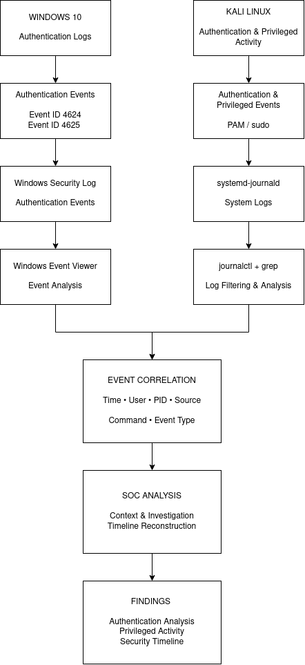
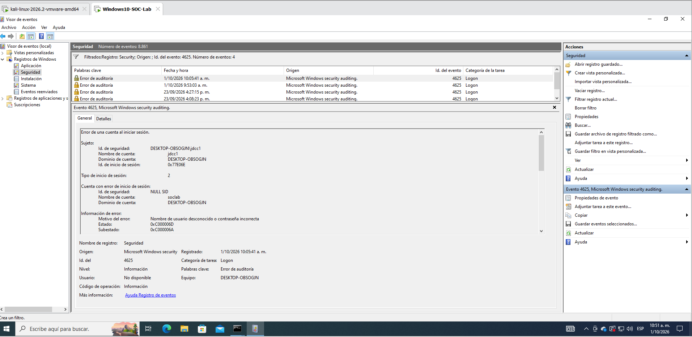
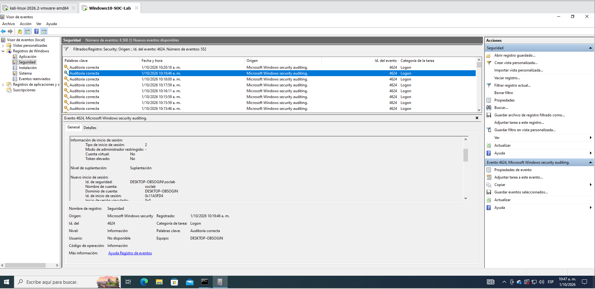
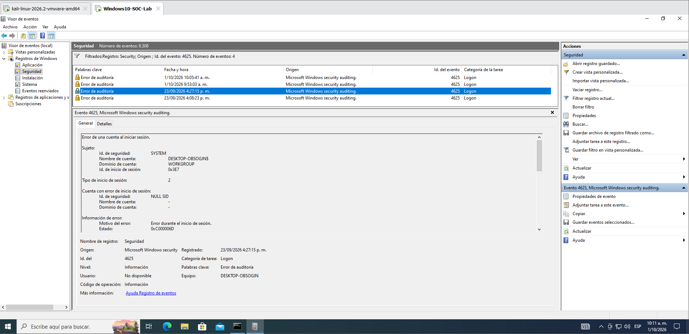
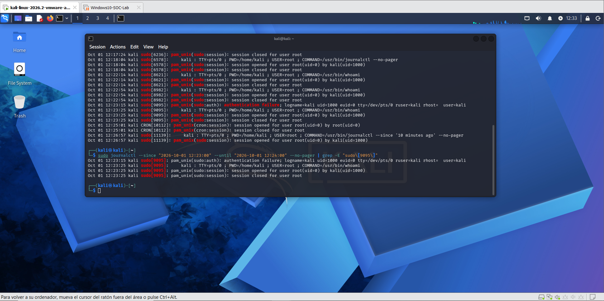
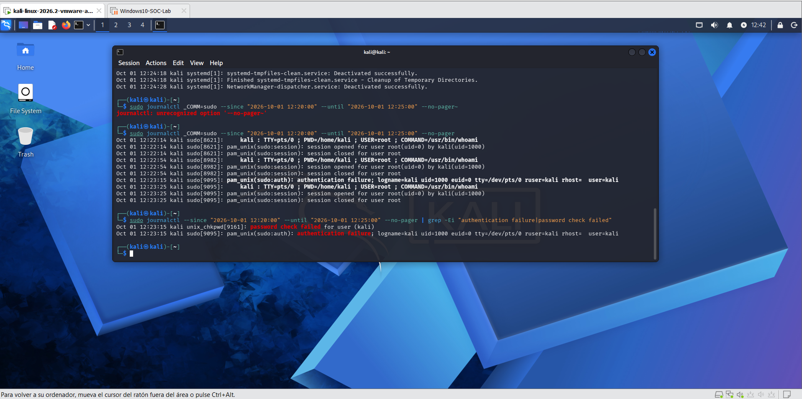
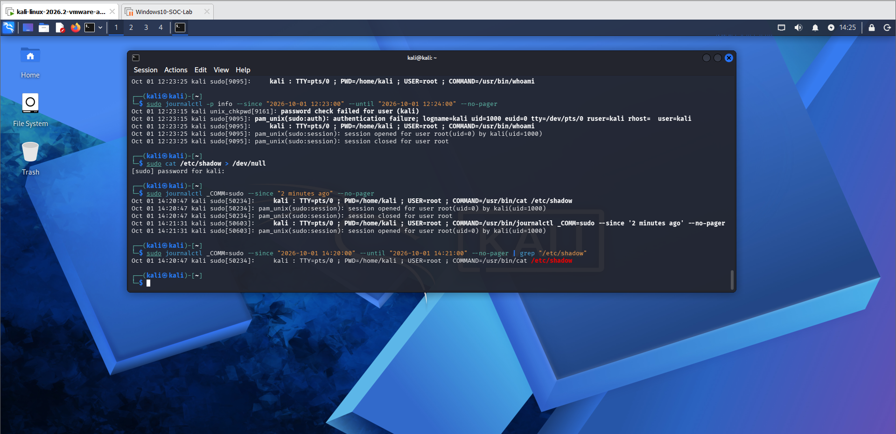
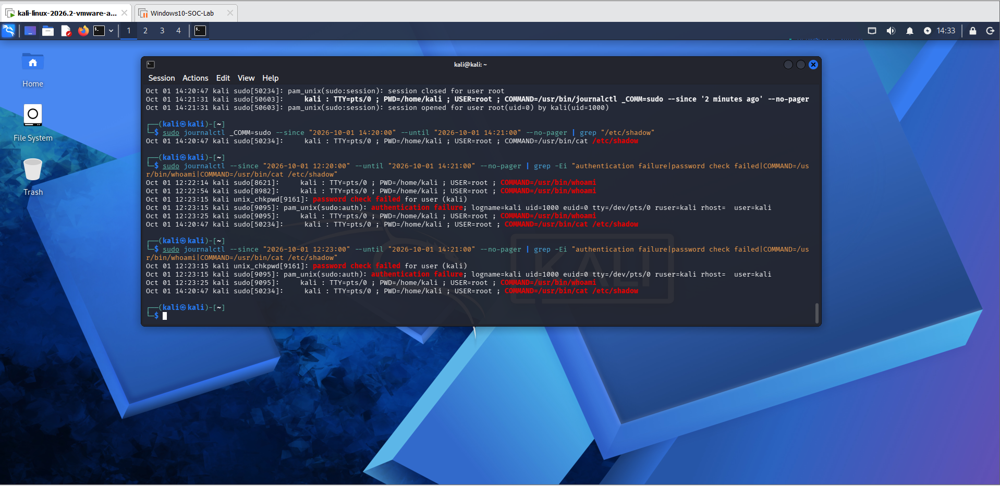

# 🔎 Lab 02 - Análisis de Logs en Windows y Linux

## 📌 Descripción

Este laboratorio tiene como objetivo desarrollar habilidades fundamentales de análisis de logs aplicadas a un entorno SOC.

Se generaron eventos de autenticación y actividad privilegiada de forma controlada en máquinas virtuales Windows 10 y Kali Linux. Posteriormente, los registros fueron consultados, filtrados y correlacionados para reconstruir la actividad observada.

El laboratorio se centra en la interpretación de eventos, reducción de ruido y correlación de registros, evitando clasificar automáticamente un evento aislado como actividad maliciosa sin analizar su contexto.

---

## 🎯 Objetivos

- Analizar eventos de autenticación en Windows.
- Identificar inicios de sesión exitosos y fallidos.
- Interpretar campos relevantes de los Event ID 4624 y 4625.
- Analizar registros de autenticación y actividad privilegiada en Linux.
- Utilizar `journalctl` para consultar eventos registrados por `systemd-journald`.
- Aplicar filtros para reducir ruido en los registros.
- Correlacionar eventos mediante usuario, tiempo, PID y actividad.
- Construir una línea de tiempo básica de eventos de seguridad.
- Documentar hallazgos siguiendo una metodología orientada al trabajo de un Analista SOC.

---

## 🖥️ Entorno de laboratorio

| Componente | Uso |
|---|---|
| VMware Workstation | Plataforma de virtualización |
| Windows 10 | Generación y análisis de eventos de seguridad de Windows |
| Kali Linux | Generación y análisis de eventos de Linux |
| Windows Event Viewer | Análisis de Event ID 4624 y 4625 |
| systemd-journald | Sistema de registro utilizado en Kali Linux |
| journalctl | Consulta y filtrado de logs |
| PAM | Análisis de eventos relacionados con autenticación |
| sudo | Generación y análisis de actividad privilegiada |

Todas las actividades fueron realizadas dentro de un entorno de laboratorio controlado.

---

---

## 🔄 Flujo de análisis de logs

El siguiente diagrama representa el flujo utilizado durante el laboratorio para analizar eventos de seguridad provenientes de Windows y Linux.

Los eventos de ambos sistemas fueron recopilados y analizados mediante sus respectivas herramientas. Posteriormente, la información relevante fue correlacionada utilizando elementos como tiempo, usuario, PID, origen, comando y tipo de evento para reconstruir la actividad observada.



El archivo fuente editable del diagrama se encuentra disponible en:

[`log-analysis-workflow.drawio`](Diagrams/log-analysis-workflow.drawio)

---

# 🪟 Windows Log Analysis

## Event ID 4625 - Failed Logon

Se generó un intento de autenticación fallido contra el usuario local `soclab` mediante credenciales alternativas.

El evento permitió identificar:

- Usuario objetivo: `soclab`
- Status: `0xC000006D`
- SubStatus: `0xC000006A`
- Logon Type: `2`
- Logon Process: `seclogo`
- Source Address: `::1`

El análisis permitió determinar que se trataba de una contraseña incorrecta para una cuenta existente y que la actividad se originó localmente.



---

## Event ID 4624 - Successful Logon

Posteriormente se realizó una autenticación correcta con la cuenta `soclab`.

Windows registró un Event ID 4624 y el comando `whoami` confirmó la ejecución de la nueva terminal bajo dicha cuenta.

La secuencia observada fue:

**Intento fallido 4625 → autenticación correcta 4624 → confirmación de usuario**



---

## Event ID 4625 - Smart Card Failure

Durante la revisión también se identificó otro Event ID 4625 relacionado con un proceso de autenticación mediante Smart Card.

El evento presentó el SubStatus:

`0xC0000380`

Aunque el registro indicaba un problema relacionado con el PIN de Smart Card, el análisis del entorno permitió determinar que en este laboratorio el comportamiento estaba relacionado con un conflicto de redirección/comunicación del dispositivo criptográfico entre Host y Guest en el entorno virtualizado.

Este caso permitió diferenciar entre el **evento observado en el log** y la **causa identificada durante la investigación**.



---

# 🐧 Linux Log Analysis

## Failed sudo Authentication

Se utilizó `sudo` para generar de forma controlada un fallo de autenticación.

Los registros mostraron eventos como:

```text
password check failed for user (kali)
pam_unix(sudo:auth): authentication failure
```

Posteriormente se produjo una autenticación correcta y la ejecución privilegiada de:

```text
/usr/bin/whoami
```

El PID asociado permitió correlacionar diferentes eventos pertenecientes a la misma operación.



---

## Filtrado de fallos de autenticación

Mediante `journalctl` y `grep` se redujo el volumen de eventos hasta mostrar únicamente registros relacionados con fallos de autenticación.

Durante el ejercicio también se observó que filtros demasiado amplios pueden generar falsos positivos y que filtros demasiado restrictivos pueden eliminar contexto relevante.



---

## Actividad privilegiada sobre `/etc/shadow`

Se generó una acción controlada sobre un archivo sensible mediante:

```bash
sudo cat /etc/shadow > /dev/null
```

La redirección a `/dev/null` evitó mostrar o almacenar el contenido del archivo.

El registro de `sudo` permitió identificar el usuario, terminal, usuario privilegiado y comando ejecutado.



---

## Correlación y línea de tiempo

Finalmente se combinaron distintos indicadores para reconstruir una línea de tiempo simplificada:

```text
12:23:15  Fallo en la comprobación de contraseña
12:23:15  Fallo de autenticación PAM
12:23:25  Ejecución privilegiada de /usr/bin/whoami
14:20:47  Actividad privilegiada sobre /etc/shadow
```

La secuencia permitió pasar del análisis de eventos individuales a una visión correlacionada de la actividad.



---

## 🔍 Principales hallazgos

El laboratorio permitió comprobar que:

1. Un Event ID por sí solo no determina si una actividad es maliciosa.
2. Los Event ID 4624 y 4625 requieren analizar campos adicionales para comprender el contexto de autenticación.
3. Los registros de PAM y `sudo` permiten investigar fallos de autenticación y actividad privilegiada en Linux.
4. La prioridad asignada a un evento no determina por sí sola su relevancia para seguridad.
5. Los filtros deben ajustarse cuidadosamente para reducir ruido sin eliminar información relevante.
6. La correlación temporal permite reconstruir secuencias de actividad a partir de eventos independientes.
7. Es importante diferenciar entre lo que registra un sistema y la causa raíz determinada durante una investigación.

---

## 📂 Documentación adicional

Los comandos utilizados durante el laboratorio están documentados en:

[`Notes/commands.md`](Notes/commands.md)

El análisis detallado de los hallazgos se encuentra en:

[`Notes/findings.md`](Notes/findings.md)

---

## 🧠 Habilidades desarrolladas

- Windows Event Log Analysis
- Linux Log Analysis
- Event ID 4624 / 4625
- Authentication Analysis
- PAM Analysis
- sudo Log Analysis
- journalctl
- Log Filtering
- Event Correlation
- Timeline Analysis
- Security Event Investigation
- SOC Analysis Fundamentals

---

## ⚠️ Nota

Todas las actividades descritas fueron realizadas intencionalmente dentro de máquinas virtuales utilizadas exclusivamente como entorno de laboratorio.

Los eventos documentados representan simulaciones controladas para desarrollar habilidades de análisis y no corresponden a una intrusión real.