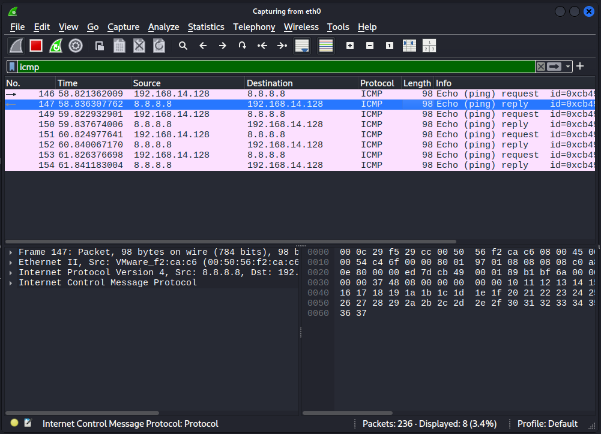
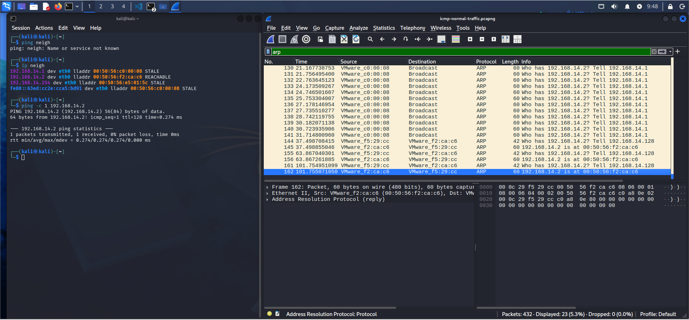
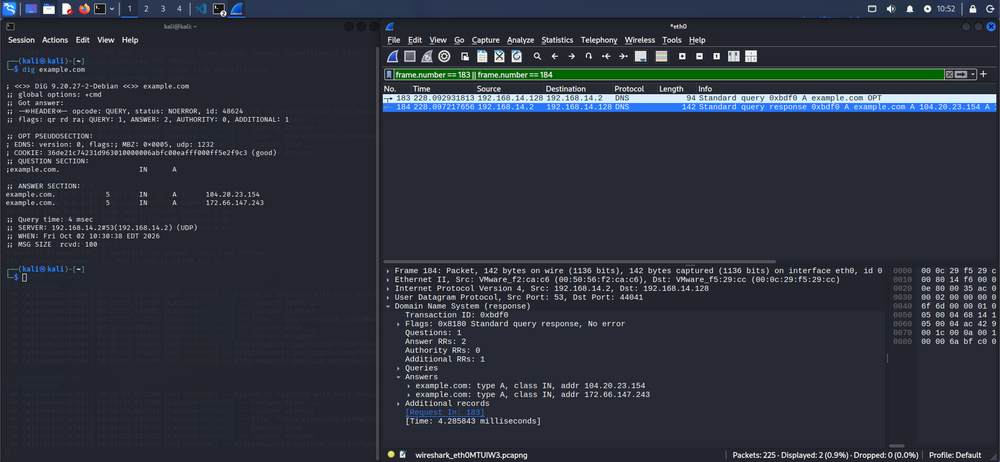
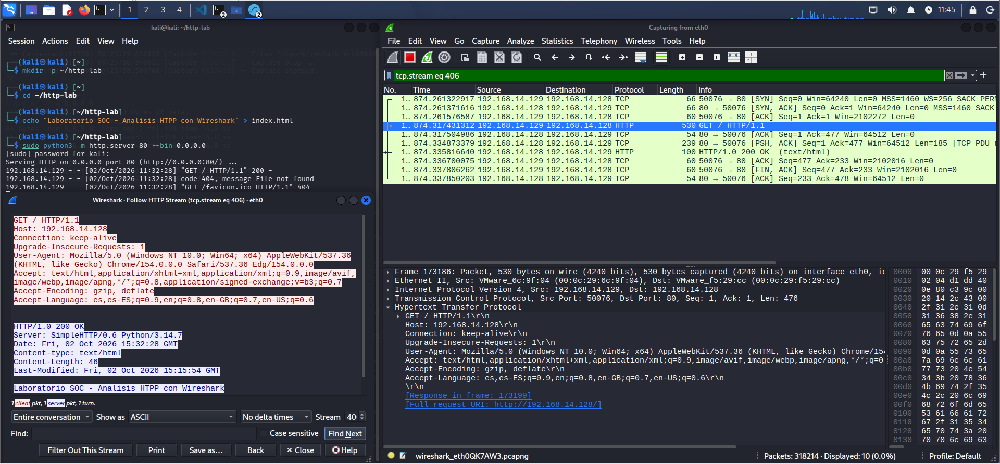
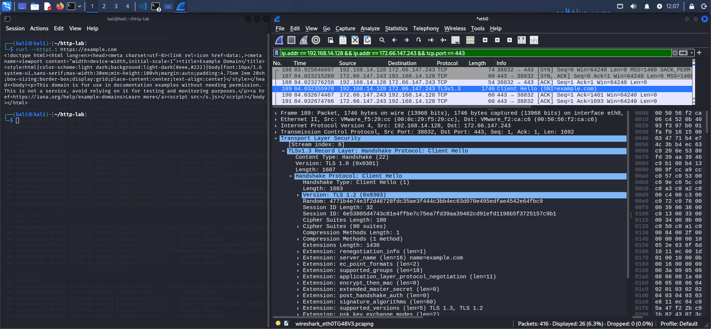
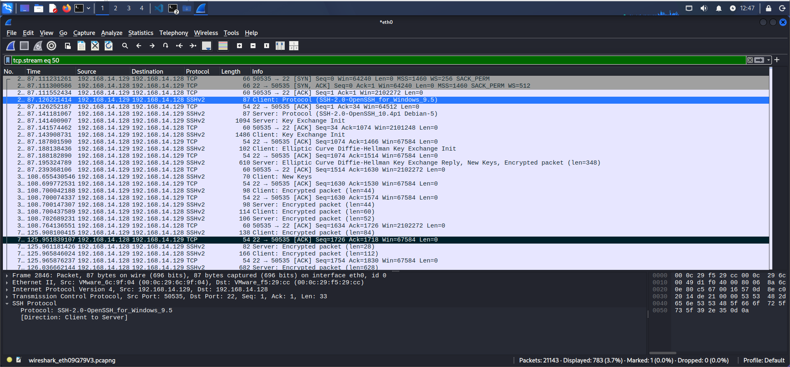
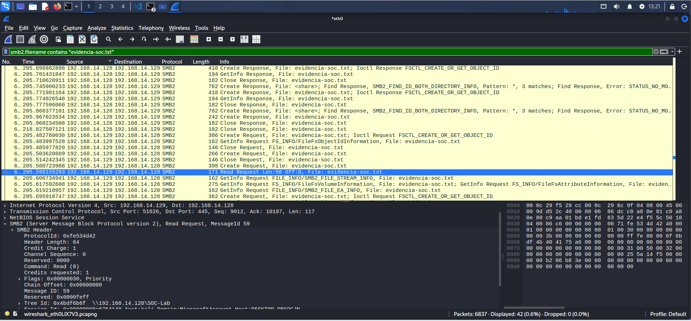
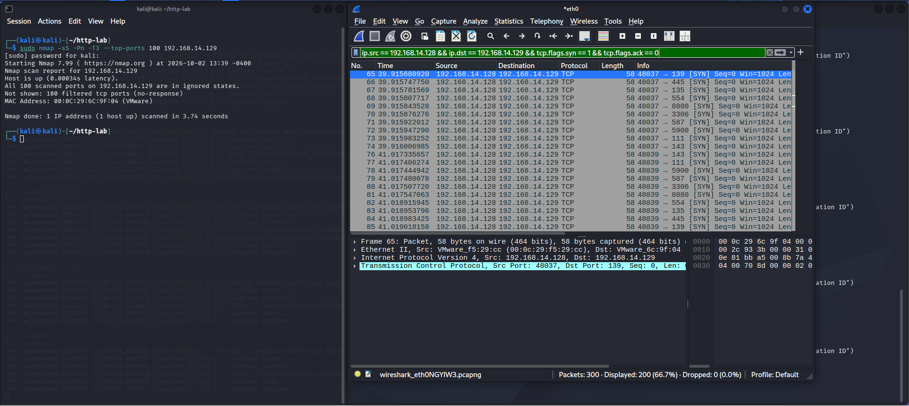
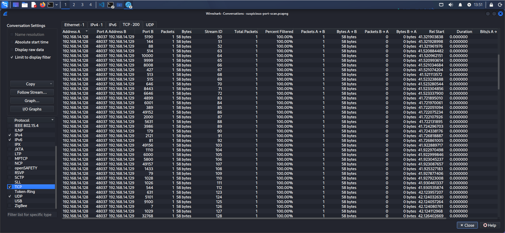

# Laboratorio 03 - Análisis de Tráfico de Red con Wireshark

## Descripción

Este laboratorio documenta el análisis de tráfico de red utilizando **Wireshark** dentro de un entorno virtualizado compuesto por Kali Linux y Windows 10.

El objetivo principal fue comprender el comportamiento de distintos protocolos de red, aplicar filtros de análisis, inspeccionar comunicaciones cifradas y no cifradas e identificar un patrón de actividad compatible con reconocimiento mediante **TCP SYN Port Scanning**.

El laboratorio fue desarrollado con un enfoque orientado a las tareas realizadas por un **Analista SOC / Blue Team**.

---

## Objetivos

- Capturar tráfico de red utilizando Wireshark.
- Identificar direcciones IP de origen y destino.
- Analizar protocolos comunes de red.
- Comprender el funcionamiento básico de TCP/IP.
- Analizar ICMP y ARP.
- Analizar consultas y respuestas DNS.
- Comparar tráfico HTTP y HTTPS/TLS.
- Identificar sesiones SSH.
- Analizar operaciones SMB2.
- Utilizar filtros de visualización de Wireshark.
- Analizar conversaciones y TCP Streams.
- Identificar patrones anómalos de tráfico.
- Detectar un patrón compatible con TCP SYN Port Scanning.
- Correlacionar resultados de Wireshark con otras herramientas.
- Documentar evidencias y hallazgos desde una perspectiva SOC.

---

# Entorno del laboratorio

## Kali Linux

```text
IP: 192.168.14.128
Interfaz: eth0
Wireshark: 4.6.6
```

Kali Linux fue utilizado como:

- estación principal de análisis,
- servidor HTTP,
- servidor SSH,
- servidor SMB mediante Samba,
- origen del escaneo TCP SYN controlado.

## Windows 10

```text
IP: 192.168.14.129
```

Windows 10 fue utilizado como:

- cliente HTTP,
- cliente SSH,
- cliente SMB,
- sistema objetivo durante la simulación de reconocimiento.

## Virtualización

```text
VMware Workstation
```

Ambos sistemas fueron utilizados dentro de una red virtual controlada.

---

# Topología

```text
                    VMware Workstation
                           |
                  Red virtual del Lab
                    192.168.14.0/24
                           |
             +-------------+-------------+
             |                           |
             |                           |
        Kali Linux                  Windows 10
      192.168.14.128              192.168.14.129
             |                           |
             |                           |
        Wireshark                  Cliente / Target
             |                           |
             +-------- Tráfico ----------+
```

---

# Protocolos analizados

| Protocolo | Puerto / Tipo | Análisis realizado |
|---|---|---|
| ICMP | Echo Request / Reply | Comprobación de conectividad |
| ARP | Resolución IP-MAC | Identificación de vecinos |
| DNS | UDP/53 | Consulta y respuesta DNS |
| HTTP | TCP/80 | Inspección de contenido en texto claro |
| HTTPS/TLS | TCP/443 | Análisis de handshake y tráfico cifrado |
| SSH | TCP/22 | Identificación de sesión remota cifrada |
| SMB2 | TCP/445 | Acceso y lectura de archivo compartido |
| TCP | Múltiples puertos | Identificación de SYN Port Scan |

---

# Herramientas utilizadas

- Wireshark
- tshark
- Nmap
- OpenSSH
- Samba
- Python HTTP Server
- curl
- dig
- ping
- ip
- ss
- VMware Workstation

---

# 1. Análisis ICMP

Se generaron cuatro solicitudes ICMP Echo Request desde Kali Linux hacia `8.8.8.8`.

Wireshark permitió identificar las solicitudes y sus correspondientes respuestas.

```text
192.168.14.128 → 8.8.8.8
Echo Request

8.8.8.8 → 192.168.14.128
Echo Reply
```

El comportamiento observado correspondió a una prueba legítima de conectividad.

### Evidencia



Captura disponible en:

```text
Captures/icmp-normal-traffic.pcapng
```

---

# 2. Análisis ARP

Se analizó el proceso utilizado por Kali Linux para descubrir la dirección MAC asociada a `192.168.14.2`.

Wireshark registró:

```text
Who has 192.168.14.2? Tell 192.168.14.128
```

seguido de:

```text
192.168.14.2 is at 00:50:56:f2:ca:c6
```

La actividad correspondió al funcionamiento normal de ARP dentro de la red local.

### Evidencia



Captura disponible en:

```text
Captures/arp-normal-traffic.pcapng
```

---

# 3. Análisis DNS

Desde Kali Linux se realizó una consulta:

```bash
dig example.com
```

Wireshark permitió identificar una consulta DNS tipo `A` y su correspondiente respuesta.

Durante la prueba fueron observadas direcciones IPv4 asociadas al dominio consultado.

La captura permitió demostrar cómo DNS puede proporcionar información relevante durante una investigación de seguridad.

### Evidencia



Captura disponible en:

```text
Captures/dns-normal-traffic.pcapng
```

---

# 4. Análisis HTTP

Se ejecutó un servidor HTTP sobre Kali Linux:

```text
192.168.14.128:80
```

Windows 10 realizó una solicitud hacia el servidor.

Wireshark permitió observar directamente:

```text
GET / HTTP/1.1
```

y:

```text
HTTP/1.0 200 OK
```

Utilizando:

```text
Follow HTTP Stream
```

también fue posible reconstruir el contenido transmitido:

```text
Laboratorio SOC - Analisis HTTP con Wireshark
```

Esto permitió comprobar que **HTTP no cifra el contenido de aplicación**.

### Evidencia



Captura disponible en:

```text
Captures/http-normal-traffic.pcapng
```

---

# 5. Análisis HTTPS / TLS

Se realizó una conexión HTTPS desde Kali Linux hacia:

```text
https://example.com
```

Wireshark permitió identificar elementos del establecimiento de la sesión TLS como:

```text
Client Hello
Server Hello
Application Data
```

También se observó información del handshake como:

```text
SNI = example.com
```

A diferencia del análisis HTTP, el contenido web no fue visible directamente en texto claro dentro de la captura.

La prueba demostró que el cifrado protege el contenido de aplicación, aunque determinados metadatos de red continúan disponibles para análisis.

### Evidencia



Captura disponible en:

```text
Captures/https-tls-traffic.pcapng
```

---

# 6. Análisis SSH

Se estableció una conexión SSH desde Windows 10:

```text
192.168.14.129
```

hacia Kali Linux:

```text
192.168.14.128:22
```

Wireshark permitió observar:

```text
TCP Three-Way Handshake
Client Protocol
Server Protocol
Key Exchange Init
Encrypted packet
```

Aunque durante la sesión se ejecutaron comandos como:

```text
whoami
hostname
```

estos no fueron visibles directamente en la captura debido al cifrado proporcionado por SSH.

### Evidencia



Captura disponible en:

```text
Captures/ssh-traffic.pcapng
```

---

# 7. Análisis SMB2

Se configuró un recurso compartido en Kali Linux:

```text
SOC-Lab
```

Windows 10 accedió al recurso mediante:

```text
\\192.168.14.128\SOC-Lab
```

y realizó una lectura sobre:

```text
evidencia-soc.txt
```

Wireshark permitió identificar operaciones SMB2 como:

```text
Create Request
Read Request
Read Response
GetInfo Request
Close Request
```

Este tipo de tráfico resulta especialmente relevante para investigaciones relacionadas con transferencia de archivos, movimiento lateral y actividad interna dentro de redes Windows.

### Evidencia



Captura disponible en:

```text
Captures/smb-traffic.pcapng
```

---

# 8. Identificación de actividad sospechosa

Para simular actividad de reconocimiento dentro del laboratorio se ejecutó un TCP SYN Scan controlado desde Kali Linux contra Windows 10.

```bash
sudo nmap -sS -Pn -T3 --top-ports 100 192.168.14.129
```

Wireshark permitió identificar múltiples paquetes SYN enviados desde:

```text
192.168.14.128
```

hacia numerosos puertos de:

```text
192.168.14.129
```

Entre los puertos observados se encontraron:

```text
135
139
445
554
587
3306
5900
8080
```

El patrón observado fue:

```text
Una IP origen
      +
Un host destino
      +
Numerosos puertos
      +
Múltiples paquetes SYN
      +
Intervalo temporal reducido
```

Este comportamiento es **compatible con actividad de reconocimiento mediante TCP SYN Port Scanning**.

### Evidencia



Captura disponible en:

```text
Captures/suspicious-port-scan.pcapng
```

---

# 9. Análisis de conversaciones TCP

Para complementar el análisis se utilizó:

```text
Statistics → Conversations → TCP
```

Esta vista permitió observar múltiples intentos de conexión desde un mismo origen hacia numerosos puertos del mismo sistema destino.

El análisis agregado facilitó identificar el patrón de reconocimiento sin depender únicamente de paquetes individuales.

### Evidencia



---

# 10. Análisis de respuestas al escaneo

Se buscaron respuestas `SYN/ACK` provenientes de Windows:

```text
ip.src == 192.168.14.129 &&
ip.dst == 192.168.14.128 &&
tcp.flags.syn == 1 &&
tcp.flags.ack == 1
```

Resultado:

```text
0 paquetes
```

También se buscaron respuestas `RST`:

```text
ip.src == 192.168.14.129 &&
ip.dst == 192.168.14.128 &&
tcp.flags.reset == 1
```

Resultado:

```text
0 paquetes
```

Durante la captura analizada, las solicitudes SYN no recibieron una respuesta observable desde el sistema destino.

Esto fue consistente con el resultado obtenido durante la prueba controlada:

```text
filtered (no-response)
```

No se atribuyó este comportamiento a un mecanismo específico de filtrado sin evidencia adicional.

---

# Comparación HTTP vs HTTPS

| Característica | HTTP | HTTPS/TLS |
|---|---|---|
| Puerto habitual | TCP/80 | TCP/443 |
| Contenido cifrado | No | Sí |
| Método GET visible | Sí | No directamente |
| Respuesta HTTP visible | Sí | No directamente |
| Contenido HTML visible | Sí | No directamente |
| IP origen/destino visible | Sí | Sí |
| Puerto visible | Sí | Sí |
| Tamaños y tiempos visibles | Sí | Sí |
| Información del handshake | No aplica | Sí |

Uno de los principales aprendizajes fue que:

```text
Tráfico cifrado ≠ tráfico invisible
```

Incluso cuando el contenido está protegido, los metadatos continúan siendo útiles para el análisis defensivo.

---

# Filtros principales de Wireshark

## ICMP

```text
icmp
```

## ARP

```text
arp
```

## DNS

```text
dns
```

## HTTP

```text
http
```

## TLS

```text
tls
```

## SSH

```text
tcp.port == 22
```

## SMB

```text
tcp.port == 445
```

```text
smb2.filename contains "evidencia-soc.txt"
```

## TCP SYN Scan

```text
ip.src == 192.168.14.128 && ip.dst == 192.168.14.129 && tcp.flags.syn == 1 && tcp.flags.ack == 0
```

---

# Principales hallazgos

| ID | Hallazgo | Clasificación |
|---|---|---|
| F01 | ICMP Echo Request / Reply | Actividad legítima |
| F02 | Resolución ARP | Actividad legítima |
| F03 | Consulta DNS | Actividad legítima |
| F04 | Contenido HTTP visible | Tráfico sin cifrado |
| F05 | HTTPS/TLS | Tráfico cifrado |
| F06 | Sesión SSH | Tráfico cifrado |
| F07 | Acceso SMB2 | Actividad legítima controlada |
| F08 | TCP SYN Scan | Actividad sospechosa de reconocimiento |

El detalle completo de cada hallazgo está disponible en:

```text
Notes/findings.md
```

---

# Estructura del laboratorio

```text
03-Network-Traffic-Analysis/
│
├── Captures/
│   ├── arp-normal-traffic.pcapng
│   ├── dns-normal-traffic.pcapng
│   ├── http-normal-traffic.pcapng
│   ├── https-tls-traffic.pcapng
│   ├── icmp-normal-traffic.pcapng
│   ├── smb-traffic.pcapng
│   ├── ssh-traffic.pcapng
│   └── suspicious-port-scan.pcapng
│
├── Diagrams/
│
├── Notes/
│   ├── commands.md
│   ├── findings.md
│   └── notes.md
│
├── Screenshots/
│   ├── 01-icmp-analysis.png
│   ├── 02-arp-analysis.png
│   ├── 03-dns-analysis.png
│   ├── 04-http-analysis.png
│   ├── 05-https-tls-analysis.png
│   ├── 06-ssh-analysis.png
│   ├── 07-smb-analysis.png
│   ├── 08-suspicious-port-scan.png
│   └── 09-port-scan-conversations.png
│
└── README.md
```

---

# Documentación adicional

## Comandos utilizados

```text
Notes/commands.md
```

Contiene los comandos, filtros y herramientas utilizados para reproducir las pruebas.

## Hallazgos

```text
Notes/findings.md
```

Contiene el análisis de los eventos desde una perspectiva SOC.

## Notas técnicas

```text
Notes/notes.md
```

Contiene conceptos relacionados con TCP/IP, protocolos, cifrado, filtros y análisis de tráfico.

---

# Metodología de análisis

Durante el laboratorio se aplicó el siguiente flujo:

```text
Generación de tráfico
        ↓
Captura con Wireshark
        ↓
Filtrado
        ↓
Identificación de hosts
        ↓
Identificación de protocolos
        ↓
Análisis de conversaciones
        ↓
Correlación
        ↓
Identificación de patrones
        ↓
Clasificación
        ↓
Documentación
```

---

# Habilidades desarrolladas

Este laboratorio permitió practicar habilidades relacionadas con:

- Network Traffic Analysis
- Packet Analysis
- Wireshark
- TCP/IP
- DNS Analysis
- HTTP Analysis
- TLS Analysis
- SSH Analysis
- SMB Analysis
- TCP Flag Analysis
- Port Scan Detection
- Threat Detection
- Network Reconnaissance Analysis
- PCAP Analysis
- Security Event Investigation
- SOC Analysis
- Blue Team Fundamentals

---

# Conclusiones

El laboratorio permitió comprender cómo diferentes protocolos se manifiestan dentro de una captura de red y qué información puede obtenerse mediante Wireshark.

Se analizaron comunicaciones legítimas mediante ICMP, ARP, DNS, HTTP, HTTPS/TLS, SSH y SMB2.

También se generó de forma controlada un escenario de reconocimiento mediante TCP SYN scanning.

El análisis permitió identificar un patrón caracterizado por múltiples paquetes SYN dirigidos desde un único origen hacia numerosos puertos del mismo sistema destino en un intervalo corto.

Aunque este comportamiento es compatible con reconocimiento, la captura por sí sola no permite determinar intención maliciosa. En un entorno SOC real sería necesario correlacionar la evidencia de red con otras fuentes, como:

- logs de firewall,
- eventos del sistema,
- IDS/IPS,
- EDR,
- SIEM,
- inteligencia de amenazas,
- contexto del activo y del usuario.

El laboratorio permitió aplicar un principio fundamental del análisis defensivo:

> **Un paquete aislado proporciona información; el patrón y el contexto permiten construir una investigación.**

---

## Autor

**David Castillo**

Ingeniero en Automática Industrial  
Estudiante de Especialización en Seguridad Informática  

En formación práctica orientada a:

```text
SOC Analyst
Blue Team
Cybersecurity Analyst
Incident Detection & Response
```